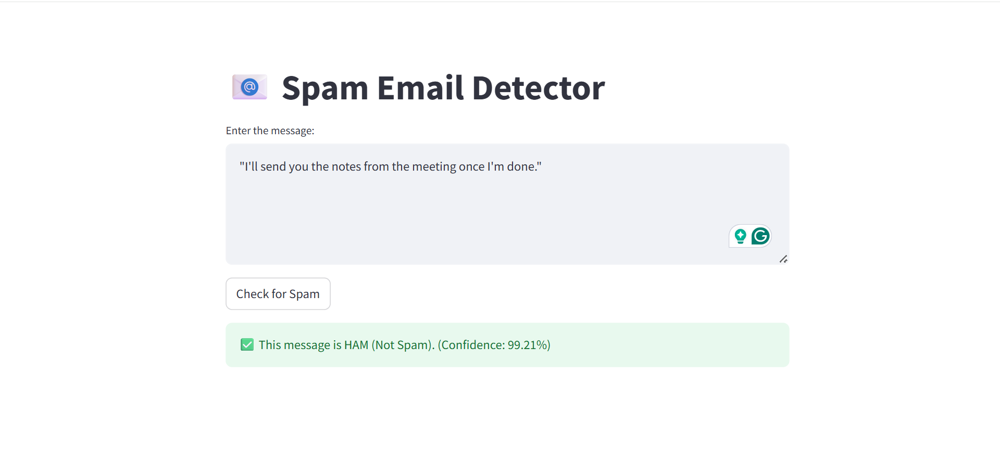

# 📧 Spam Email Detection using Machine Learning

This project detects whether a given message is **Spam** or **Ham (Not Spam)** using a Machine Learning model trained on a labeled SMS dataset. A simple yet effective Streamlit app is also included for real-time prediction.

---

## 🚀 Features

- Preprocessing and training using **TF-IDF** + **Naive Bayes**
- High accuracy with minimal overfitting
- Real-time prediction in a **Streamlit Web App**
- Saved model using `joblib` for easy reuse

---

## 🧠 Model Info

- **Algorithm**: Multinomial Naive Bayes
- **Vectorizer**: TfidfVectorizer
- **Training Accuracy**: 98.38%
- **Testing Accuracy**: 96.68%
- **Evaluation**: Confusion matrix, classification report

---

## 🖥️ Streamlit App

### Preview



### How to Run

```bash
# Install dependencies
pip install -r requirements.txt

# Run the app
streamlit run app.py
